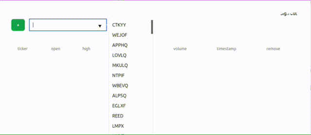

# Basket

Watch your "basket" of stocks in real-time with data from [Alpaca](https://alpaca.markets/).

Basket is intended as a template; it provides a working example of a Phoenix Framework web server utilizing
the following tools and patterns:

- Continuous Integration
- [Phoenix Channels](https://hexdocs.pm/phoenix/channels.html)
- [Phoenix LiveView](https://hexdocs.pm/phoenix_live_view/Phoenix.LiveView.html)
- [Phoenix Presence](https://hexdocs.pm/phoenix/presence.html)
- [Pow](https://github.com/pow-auth/pow)
- Search Autocomplete (in LiveView)
- [WebSockex](https://github.com/Azolo/websockex)

Basket also serves as a reference for testing patterns:

- [ExMachina](https://hexdocs.pm/ex_machina/ExMachina.html)
- [Mox](https://github.com/dashbitco/mox)
- [Test Server](https://github.com/danschultzer/test_server)

Many thanks to the authors of these excellent libraries!

## Setup

### Install

- Ensure Postgres is running. If using Docker, `docker start postgres` usually works well.
- Run `mix setup` to install and set up dependencies
- Start the development server with `make dev`
- Now you can visit [`localhost:4000`](http://localhost:4000) from your browser.

### Create a Dev User

- Unauthenticated users will be redirected to the registration page as per [Pow](https://github.com/pow-auth/pow) standards.
  Sign up and verify your email (for a quick fix, populate the `email_verified_at` column in the `User` table)
- Log in and watch your basket!

## Architecture

Basket uses HTTP and WebSocket connections to ingress stock data. The real-time updates are
received over WebSocket and distributed through Phoenix Channels, one per stock ticker. Phoenix
Presence is utilized to track ticker subscription lifecycles for all users in aggregate against
the WebSocket client, sharing one client connection efficiently.
